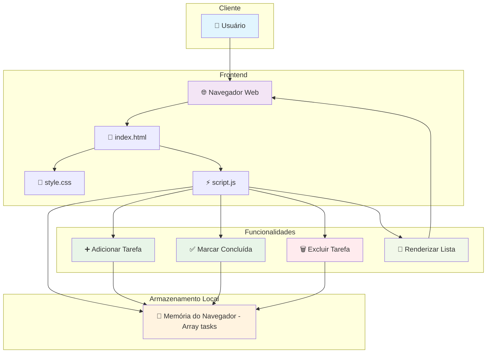

# Gerenciador de Tarefas - Amazon Q Developer Quest TDC 2025

## Problema que inspirou a ideia
Necessidade de uma ferramenta simples e eficiente para gerenciar tarefas do dia a dia, sem complexidades desnecessárias.

## Como a solução foi construída
- **Frontend**: HTML5, CSS3 e JavaScript vanilla
- **Funcionalidades**: Adicionar, marcar como concluída e excluir tarefas
- **Armazenamento**: Local (memória do navegador durante a sessão)
- **Design**: Interface limpa e responsiva

## Diagrama de Arquitetura

## Instruções para rodar
1. Clone o repositório
2. Abra o arquivo `index.html` em qualquer navegador web
3. Comece a adicionar suas tarefas!

## Testes
Para executar os testes unitários:
1. Abra o arquivo `test.html` no navegador
2. Os testes serão executados automaticamente
3. Veja os resultados na página

## Estimativa de Custo AWS

### Cenário 1: Hospedagem Estática Simples
**Serviços utilizados:**
- **Amazon S3** (hospedagem estática): $0.023/GB/mês
- **Amazon CloudFront** (CDN): $0.085/GB transferido

**Estimativa mensal:**
- Armazenamento (1GB): $0.02
- Transferência (10GB): $0.85
- **Total: ~$0.87/mês**

### Cenário 2: Aplicação Completa com Backend
**Serviços utilizados:**
- **Amazon S3**: $0.02/mês
- **AWS Lambda** (API): $0.20/1M requests
- **Amazon DynamoDB** (banco): $0.25/GB/mês
- **Amazon CloudFront**: $0.85/mês

**Estimativa mensal (1000 usuários):**
- S3: $0.02
- Lambda (100K requests): $0.02
- DynamoDB (1GB): $0.25
- CloudFront: $0.85
- **Total: ~$1.14/mês**

### Cenário 3: Produção com Alta Disponibilidade
**Serviços utilizados:**
- Todos os anteriores +
- **Application Load Balancer**: $16.20/mês
- **Amazon RDS** (t3.micro): $12.41/mês
- **AWS WAF**: $5.00/mês

**Estimativa mensal:**
- **Total: ~$35/mês**

> 💡 **Dica**: Use o [AWS Pricing Calculator](https://calculator.aws) para estimativas personalizadas

> 🆓 **AWS Free Tier**: Muitos serviços têm 12 meses gratuitos para novos usuários

## Próximos passos
- Implementar persistência local com localStorage
- Adicionar categorias de tarefas
- Implementar filtros (todas, pendentes, concluídas)
- Adicionar data de vencimento
- Melhorar a experiência mobile

## Prompts utilizados com Amazon Q Developer
1. "vou te passar um contexto de um projeto, quero que você faça apenas a etapa 1, da maneira mais simples possivel, um front end que eu consiga adicionar tarefas para gerenciar minhas tarefas do dia a dia"
2. "onde está meu projeto local?"
3. "me dê o caminho completo"
4. "deixe esse front end disponivel na minha porta local host"
5. "gere um .zip desse projeto, quero subir no git"
6. "gere um resumo dos prompts que foram utilizados"
7. "me de apenas os prompts, sem as respostas"
8. "agora gere um .zip para que eu consiga fazer o download e ter esse projeto completo na minha maquina local"
9. "construa os testes unitários para esse projeto"
10. "gere o diagrama de arquitetura e adicione ao README.MD"
11. "adicione uma estimativa de custo para implementação na AWS"

## Tags
`q-developer-quest-tdc-2025`

## Evidência da execução

