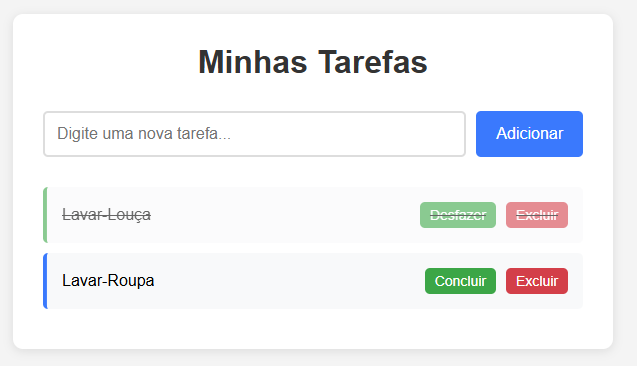

# Gerenciador de Tarefas - Amazon Q Developer Quest TDC 2025

## Problema que inspirou a ideia
Necessidade de uma ferramenta simples e eficiente para gerenciar tarefas do dia a dia, sem complexidades desnecessárias.

## Como a solução foi construída
- **Frontend**: HTML5, CSS3 e JavaScript vanilla
- **Funcionalidades**: Adicionar, marcar como concluída e excluir tarefas
- **Armazenamento**: Local (memória do navegador durante a sessão)
- **Design**: Interface limpa e responsiva

## Instruções para rodar
1. Clone o repositório
2. Abra o arquivo `index.html` em qualquer navegador web
3. Comece a adicionar suas tarefas!

## Próximos passos
- Implementar persistência local com localStorage
- Adicionar categorias de tarefas
- Implementar filtros (todas, pendentes, concluídas)
- Adicionar data de vencimento
- Melhorar a experiência mobile

## Prompts utilizados com Amazon Q Developer
1. "vou te passar um contexto de um projeto, quero que você faça apenas a etapa 1, da maneira mais simples possivel, um front end que eu consiga adicionar tarefas para gerenciar minhas tarefas do dia a dia"
2. "onde está meu projeto local?"
3. "me dê o caminho completo"
4. "deixe esse front end disponivel na minha porta local host"
5. "gere um .zip desse projeto, quero subir no git"
6. "gere um resumo dos prompts que foram utilizados"
7. "me de apenas os prompts, sem as respostas"
8. "agora gere um .zip para que eu consiga fazer o download e ter esse projeto completo na minha maquina local"

## Tags
`q-developer-quest-tdc-2025`

## Evidência da execução
